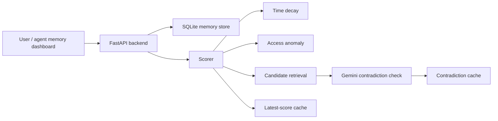

# ContextClock

ContextClock is a local prototype for detecting when an AI agent's stored memories have fallen out of date. The system combines time-based decay, access-pattern anomalies, and Gemini-based contradiction checks to assign a staleness score to each memory.

## Problem it solves

AI agents often accumulate long-lived memory entries that were valid at the time they were written but later became outdated. This project is designed to help answer a simple question: which memories should an agent treat as stale, aging, or expired?

## Why it exists

The project sits between a memory store and an agent runtime. Instead of treating every memory as permanently valid, it tries to measure how likely a memory is no longer current based on:

- age of the memory
- whether newer memories contradict it
- whether the agent has recently used it

## Key features

- SQLite-backed local memory persistence
- user and agent scoped storage
- weighted staleness scoring using time decay + contradiction + access anomaly
- Gemini-based contradiction detection for newer-memory comparisons
- cached contradiction results to reduce repeated API calls
- a local dashboard for creating and checking memories
- research evaluation scripts for the STALE benchmark

## Architecture overview

The repository is split into a Python backend and a Next.js frontend.



## How the system works

1. A memory is created with a `content`, `category`, `user_id`, and `agent_id`.
2. The backend stores it locally in SQLite.
3. When a user requests a score, the backend computes:
   - time decay by category half-life
   - access anomaly from recency and usage patterns
   - contradiction against newer, relevant memories
4. The weighted final score is converted into one of four staleness states:
   - `fresh`
   - `aging`
   - `stale`
   - `expired`
5. Scores are persisted per user/agent scope so the UI can reload them without recomputing everything immediately.

## Project structure

```text
contextclock/
├── backend/
│   ├── app/
│   │   ├── api/
│   │   ├── core/
│   │   ├── evaluation/
│   │   ├── models/
│   │   └── services/
│   ├── tests/
│   ├── requirements.txt
│   ├── .env.example
│   ├── scripts/
│   └── ...
├── frontend/
│   ├── src/
│   ├── package.json
│   ├── package-lock.json
│   └── ...
├── docs/
│   ├── architecture.md
│   └── repository-readiness.md
├── .env.example
├── .gitignore
├── CONTRIBUTING.md
├── SECURITY.md
├── README.md
└── .github/
    └── workflows/
        └── ci.yml
```

## Technology stack

### Backend

- Python 3.11+
- FastAPI
- SQLAlchemy
- Pydantic
- Google Gemini API (`google-genai`)
- sentence-transformers
- SQLite

### Frontend

- Next.js 16
- React 19
- TypeScript
- CSS modules / Tailwind-compatible styling

## Prerequisites

- Python 3.11 or newer
- Node.js 20 or newer
- npm
- a valid Google Gemini API key

## Environment variables

The project expects environment variables from a local `.env` file or a shell environment.

### Backend

- `GEMINI_API_KEY`: required for contradiction detection
- `CONTEXTCLOCK_DB_URL`: optional; defaults to a local SQLite database when unset

### Frontend

- `NEXT_PUBLIC_API_URL`: base URL for the backend, usually `http://localhost:8000`

Use the repository template at [.env.example](.env.example) as the source for local values.

## Installation

### 1) Create the backend environment

```bash
cd backend
python -m venv .venv
```

Windows PowerShell:

```powershell
cd backend
.\.venv\Scripts\Activate.ps1
pip install -r requirements.txt
```

macOS / Linux:

```bash
cd backend
source .venv/bin/activate
pip install -r requirements.txt
```

### 2) Set local environment values

```bash
cd backend
copy .env.example .env
```

Then fill in the real `GEMINI_API_KEY` value.

### 3) Install frontend dependencies

```bash
cd frontend
npm install
```

## Running locally

### Backend

```bash
cd backend
.\.venv\Scripts\Activate.ps1
uvicorn app.main:app --reload --host 0.0.0.0 --port 8000
```

### Frontend

```bash
cd frontend
npm run dev
```

Open `http://localhost:3000` in the browser.

## API

The main API is mounted at the backend root and uses FastAPI.

### Health

- `GET /health`
- returns service health status

### Memory endpoints

- `POST /memories`
  - creates a memory entry
  - body: `content`, `category`, `user_id`, `agent_id`

- `GET /memories?user_id={user_id}&agent_id={agent_id}`
  - lists stored memories for one scope

- `GET /memories/{memory_id}/score`
  - computes a staleness score without incrementing access_count

- `POST /memories/{memory_id}/access`
  - records actual usage and increments access_count

- `GET /memories/scores?user_id={user_id}&agent_id={agent_id}`
  - returns the latest cached scores for a scope

Example create request:

```http
POST /memories
Content-Type: application/json

{
  "content": "User works at Microsoft",
  "category": "employment",
  "user_id": "demo-user",
  "agent_id": "demo-agent"
}
```

## Example usage

The dashboard can be used to:

- create a memory under a user + agent scope
- mark a memory as used
- request a fresh score
- observe whether the memory enters `aging`, `stale`, or `expired`

The backend can also be used programmatically by calling the FastAPI routes directly.

## Testing

The project includes a backend test suite under `backend/tests`.

Verified in the current repo environment:

```bash
cd backend
.\.venv\Scripts\python -m pytest -q
```

Result: `107 passed in 13.64s`.

The frontend build was also verified:

```bash
cd frontend
npm run build
```

This completed successfully in the current workspace.

## Evaluation and research workflow

The evaluation scripts under `backend/app/evaluation` are designed for the STALE benchmark and compare ContextClock against baseline methods.

Example:

```bash
cd backend
.\.venv\Scripts\Activate.ps1
python -m app.evaluation.run_stale_eval \
  --input app/evaluation/data/stale_eval.jsonl \
  --output stale_eval_results.json \
  --model gemini-3.5-flash-lite \
  --limit 20
```

This is a research-oriented workflow and depends on live Gemini calls and benchmark data.

## Database information

The project currently uses SQLite by default.

- default database: `sqlite:///./contextclock.db`
- local persistence is intentionally simple and local-first
- the app is not configured for a multi-user production database layer

## Known limitations

- the app is a local prototype, not a hardened production service
- there is no authentication or authorization layer
- the backend does not yet provide deployment configuration for a cloud environment
- the contradiction detector depends on a live Gemini API key and quota availability
- the evaluation pipeline is designed for research benchmarking, not for a real-time production system

## Future work

Potential next steps include:

- adding auth and multi-user security boundaries
- adding cloud-friendly database configuration
- expanding the benchmark and comparison suite
- improving the UI for score history and trend analysis
- packaging the backend for deployment or Docker-based local runs

## Contributing

See [CONTRIBUTING.md](CONTRIBUTING.md) for local development and validation steps.

## Security

Do not commit local `.env` files, API keys, or database state. See [SECURITY.md](SECURITY.md) for vulnerability reporting guidance.

## License

This repository does not currently include a license file. A license should be selected before a public release, and the recommended default for a repository like this is MIT if the project owner wants a permissive OSS license.

## Repository readiness status

This project is documented and reproducible locally, but it is still best described as a research-oriented prototype rather than a production deployment.
