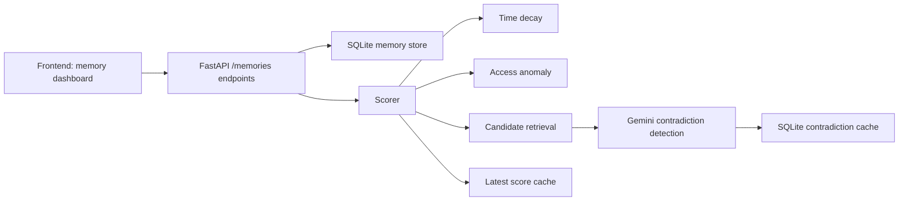

# Architecture

## Overview

ContextClock is a two-part application:

- a Python backend that models memory lifecycle and computes staleness scores
- a Next.js frontend that lets a user create a scope, inspect memories, and view their latest score

The project is a research prototype and an interactive reference implementation rather than a production deployment stack.

## High-level flow

## Major backend components

### API layer

The API entry point is in [backend/app/main.py](../backend/app/main.py). It exposes a FastAPI app with a `/health` route and includes the memory router.

The memory API in [backend/app/api/memories.py](../backend/app/api/memories.py) provides:

- `POST /memories` to create a memory
- `GET /memories` to list the memories for one user and agent
- `GET /memories/{memory_id}/score` to compute a staleness score without incrementing access_count
- `POST /memories/{memory_id}/access` to record actual usage
- `GET /memories/scores` to read the latest cached scores for a scope

### Data model

The core data structure is in [backend/app/models/memory.py](../backend/app/models/memory.py). It models:

- memory metadata
- category level (`employment`, `location`, `relationship`, `preference`, `personal`, `fact`)
- staleness levels (`fresh`, `aging`, `stale`, `expired`)
- score payloads and the result bundle returned to the UI

### Storage

The SQLite-backed persistence layer is in [backend/app/services/memory_store.py](../backend/app/services/memory_store.py). It stores:

- the memory table
- the latest-score table per user/agent scope

This keeps reloads fast and avoids repeated Gemini calls for already scored memories.

### Scoring pipeline

The production algorithm lives in [backend/app/core/scorer.py](../backend/app/core/scorer.py):

- compute time decay
- compute access anomaly
- retrieve candidate newer memories
- ask Gemini whether the newer memory contradicts or supersedes the older memory
- combine the weighted signals
- map the final score to `fresh` / `aging` / `stale` / `expired`

The weights are currently:

- time decay: 0.50
- contradiction: 0.30
- access anomaly: 0.20

### Retrieval and contradiction detection

The retrieval step is deterministic and lives in [backend/app/core/retrieval.py](../backend/app/core/retrieval.py). It filters by scope and uses sentence-transformer similarity to find the top candidate memories worth checking.

The LLM-based contradiction step is implemented in [backend/app/core/contradiction.py](../backend/app/core/contradiction.py). It calls Gemini with a strict JSON schema and falls back safely on API failure or unparseable output.

The result is cached in [backend/app/services/contradiction_cache.py](../backend/app/services/contradiction_cache.py) to avoid repeated LLM calls for the same memory pair.

## Frontend

The UI is a Next.js dashboard built from [frontend/src/app/page.tsx](../frontend/src/app/page.tsx) and the API client in [frontend/src/lib/api.ts](../frontend/src/lib/api.ts). The app:

- lets the user define a `user_id` and `agent_id`
- creates and lists memories
- checks a memory score without incrementing access_count
- records actual use as a separate access event
- displays the score distribution and staleness categories

## Data flow

1. A user creates a memory through the UI or API.
2. The backend stores the record in SQLite with user/agent scope metadata.
3. The dashboard loads memories and their cached latest scores.
4. When a user explicitly checks a memory, the backend recalculates the score.
5. The scorer combines:
   - age-based decay
   - access anomaly
   - Gemini contradiction verdict over newer candidate memories
6. The result is persisted to the latest-score table for that user/agent scope.

## Evaluation and research workflow

The benchmark-focused code is under [backend/app/evaluation](../backend/app/evaluation). It is designed around the STALE benchmark and evaluates the model on real stale-memory pairs. These scripts are research tooling and are not part of the runtime app path.

## External dependencies

- Google Gemini via `genai.Client`
- Sentence-transformers for retrieval similarity
- SQLite for local persistence
- React + Next.js for the frontend

## Security and reliability considerations

- the Gemini API key is read from the environment, not hardcoded into the app code
- the backend uses safe fallbacks when Gemini fails or returns an invalid schema
- the project currently assumes a local, single-process runtime and does not implement authentication or deployment hardening

## Known limitations

- there is no authenticated user system
- the app uses local SQLite state by default, so data is not shared across multiple services
- the frontend expects `NEXT_PUBLIC_API_URL` to point at the running backend
- the benchmark evaluation still depends on real Gemini API calls and is not a fully offline pipeline
